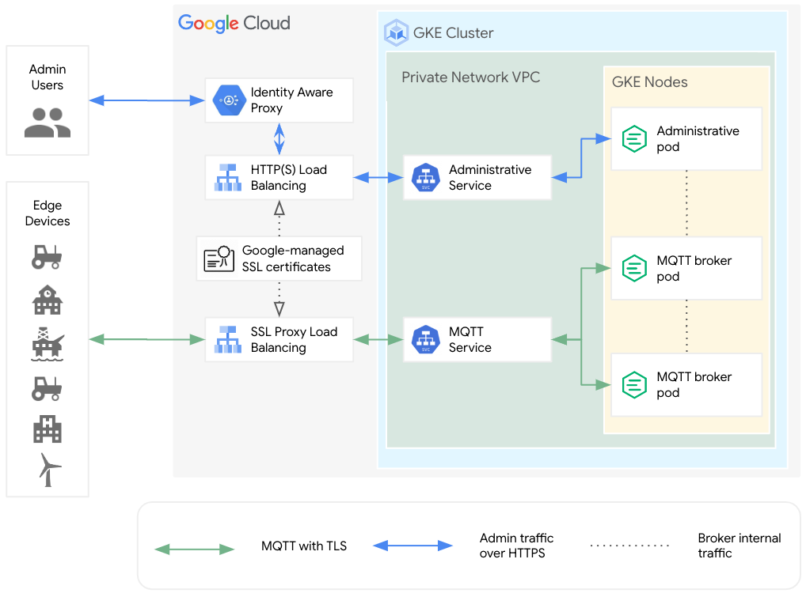

# Deploy and run MQTT brokers on GKE
This repository contains reference samples for deploy and run the [EMQX MQTT broker](terraform/emqx/README.md) on Google Kubernetes Engine.

Besides deployment of the MQTT broker, following components are also used to expose and secure the broker interfaces:
* [admin-lb](terraform/modules/admin-lb/README.md) to expose and secure the administrative interface
* [Identity Aware Proxy (IAP)](terraform/modules/iap/README.md) to access control the administrative interface
* [mqtt-lb](terraform/modules/mqtt-lb/README.md) to expose and secure the device connectivity interface

The preceding diagram summarizes the components structure created by this deployment.

Follow the [deployment guide](terraform/emqx/README.md) to create resources describeb in the diagram.